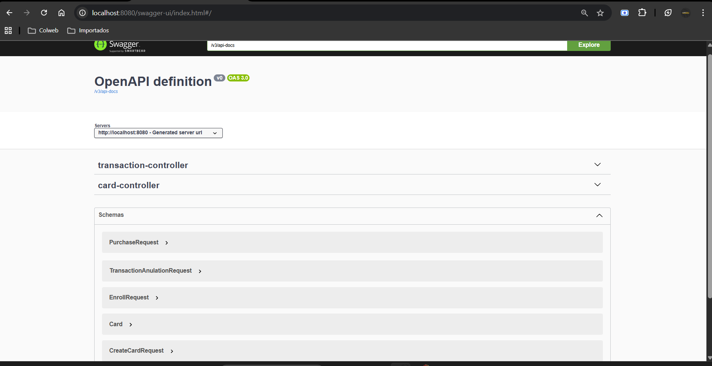

# Bank Inc - API de Gestión de Tarjetas y Transacciones

````markdown
# Bank Inc - API de Gestión de Tarjetas y Transacciones

## Descripción
API REST para administrar tarjetas y transacciones de Bank Inc.  
Permite:  
- Generar números de tarjeta  
- Activar, bloquear y recargar saldo  
- Realizar compras  
- Consultar transacciones  
- Anular transacciones dentro de 24 horas  

El proyecto está desarrollado con **Java 17**, **Spring Boot 3.5**, **Maven**, y documentado con **Swagger**.

---

## Requerimientos
- Java 17+
- Maven
- Spring Boot 3.5
- Base de datos MySQL
- Postman (para pruebas)

---

## Ejecución
Clonar repositorio y ejecutar:

```bash
git clone https://github.com/edgarmunar/springboot-bankinc
cd springboot-bankinc
mvn clean install
mvn spring-boot:run
````

La API estará disponible en `http://localhost:8080`.

---

## Swagger UI

Swagger UI permite ver y probar los endpoints de manera interactiva:

Swagger UI (local): [http://localhost:8080/swagger-ui/index.html](http://localhost:8080/swagger-ui/index.html)  
  > Nota: Este link funciona solo en tu máquina local. Para nivel 3 se desplegará en un servidor accesible públicamente.

**Captura de ejemplo:**



---

## Endpoints

| Recurso                        | Método | Descripción                            | Request Ejemplo                                          | Response Ejemplo                                               |
| ------------------------------ | ------ | -------------------------------------- | -------------------------------------------------------- | -------------------------------------------------------------- |
| `/card/{productId}/number`     | GET    | Generar número de tarjeta (16 dígitos) | -                                                        | `"1020301234567890"`                                           |
| `/card/enroll`                 | POST   | Activar tarjeta                        | `{ "cardId": "1020301234567801" }`                       | `{ "cardId": "1020301234567801", "status": "ACTIVE", ... }`    |
| `/card/{cardId}`               | DELETE | Bloquear tarjeta                       | -                                                        | `{ "cardId": "1020301234567801", "status": "BLOCKED", ... }`   |
| `/card/balance`                | POST   | Recargar saldo                         | `{ "cardId": "1020301234567801", "balance": 10000 }`     | `{ "cardId": "1020301234567801", "balance": 10000, ... }`      |
| `/card/balance/{cardId}`       | GET    | Consultar saldo                        | -                                                        | `10000`                                                        |
| `/transaction/purchase`        | POST   | Realizar compra                        | `{ "cardId": "1020301234567801", "price": 100 }`         | `{ "id": 1, "cardId": "1020301234567801", "price": 100, ... }` |
| `/transaction/{transactionId}` | GET    | Consultar transacción                  | -                                                        | `{ "id": 1, "cardId": "1020301234567801", "price": 100, ... }` |
| `/transaction/anulation`       | POST   | Anular transacción (máx. 24h)          | `{ "cardId": "1020301234567801", "transactionId": "1" }` | `"Transacción anulada exitosamente"`                           |

---

## Postman Collection

Para probar la API, importa la colección ubicada en [postman/BankInc_API.postman_collection.json](postman/BankInc_API.postman_collection.json).  
Incluye todos los endpoints con ejemplos de request y response.
---

## Manejo de errores

La API devuelve errores consistentes con `HTTP status` y mensaje en JSON:

```json
{
  "message": "Descripción del error",
  "statusCode": 400
}
```

Ejemplos:

* Tarjeta no existe
* Saldo insuficiente
* Transacción fuera de 24 horas

---


## Base de Datos

**Motor:** MySQL 8

**Esquema:** Se crean las tablas automáticamente a partir de las entidades de Spring Boot (`Card` y `Transaction`) al ejecutar la aplicación.

**Configuración local:**

```properties
spring.datasource.url=jdbc:mysql://localhost:3306/bankinc
spring.datasource.username=root
spring.datasource.password=tu_password
spring.jpa.hibernate.ddl-auto=update
````

> Ajustar `username`, `password` y `database` según tu entorno local.

**Pruebas realizadas:**

* Se probó la aplicación **con MySQL local** para verificar creación, consulta, recarga y actualización de tarjetas y transacciones.
* Se utilizaron **Postman** y la **Swagger UI** para probar todos los endpoints y verificar request/response.

**Notas para el evaluador:**

* Solo se necesita tener MySQL instalado y la base de datos `bankinc` disponible.
* Todas las tablas y relaciones se crean automáticamente al iniciar la aplicación.

---

### Capturas de pantalla

**Captura de ejemplo:**


## Notas

* Validaciones de campos con **@Valid**.
* Excepciones manejadas con **GlobalExceptionHandler**.
* Transacciones con **@Transactional** para rollback automático.
* Swagger y Postman disponibles para pruebas rápidas.

---

## Estructura del repositorio

```
springboot-bankinc/
├─ src/main/java/com/edgar/bank_tarjetas/
│  ├─ controller/
│  ├─ dto/
│  ├─ entities/
│  ├─ exceptions/
│  └─ service/
├─ postman/
│  └─ BankInc.postman_collection.json
├─ docs/screenshots/
│  └─ swagger.png
├─ pom.xml
└─ README.md
```
## 🟫 Pruebas Unitarias

El proyecto incluye pruebas unitarias utilizando **JUnit 5** y **Mockito**.  
Actualmente cubre:

### ✔️ Pruebas de CardService

### ✔️ Pruebas de TransactionService 

> El objetivo es dejar **90%+ de cobertura** en servicios antes del nivel final.

---

## 📝 Estado del proyecto

Este proyecto se encuentra **100% funcional**, probado con Swagger UI y Postman,  
con la base de datos MySQL correctamente generada vía JPA.

Las pruebas unitarias están **en proceso de completar cobertura**,  
pero el esqueleto del sistema está completamente sólido, modular y validado.

## ✔️ Checklist de funcionalidades implementadas

Este proyecto cumple con todos los requisitos funcionales solicitados para el reto técnico de **Bank Inc**:

---

## 🟦 Funcionalidades de Tarjetas

- [x] **Generar número de tarjeta** .
- [x] **Crear tarjeta** .
- [x] **Activar tarjeta**.
- [x] **Bloquear tarjeta**.
- [x] **Recargar saldo**.
- [x] **Consultar saldo** de la tarjeta.
---

## 🟩 Funcionalidades de Transacciones

- [x] **Realizar compra** (purchase).
- [x] **Consultar transacción** por ID.
- [x] **Anulación de transacción**:

---

## 🟧 Arquitectura y buenas prácticas aplicadas

- [x] API REST con **Spring Boot 3**.
- [x] Persistencia con **Spring Data JPA + MySQL**.
- [x] Manejo centralizado de errores con `GlobalExceptionHandler`.
- [x] Uso de DTOs para requests (POST/PUT).
- [x] Transacciones  `@Transactional`.
- [x] Documentación con **Swagger UI**.
- [x] Postman Collection incluida.
- [x] Proyecto estructurado en capas:  
  `controller / dto / service / repository / entities / exceptions`.

---

---

## Autor

Edgar Munar Villamil


